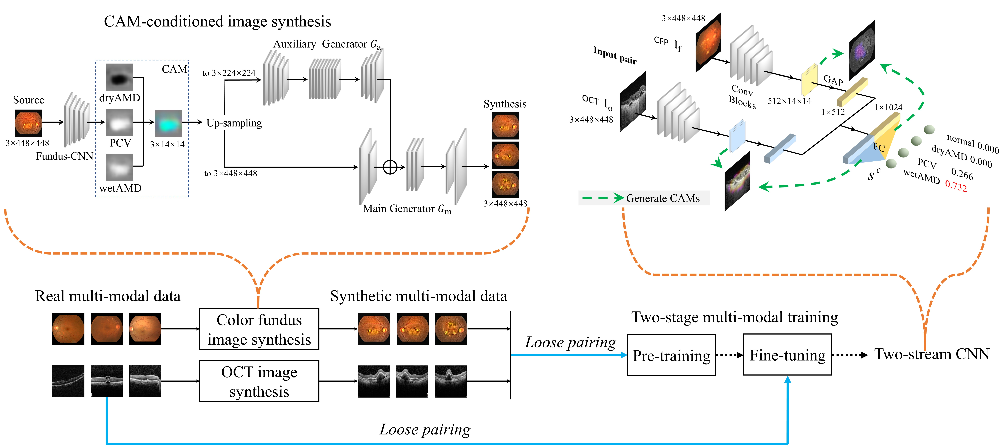

# MMC-AMD

##### |[Paper](https://arxiv.org/pdf/2012.01879)|

Code and data for multi-modal categorization of age-related macular degeneration (4 classes: normal, dry AMD, pcv, wet AMD)

<center>
    
    <br>
    <div style="color:orange;  display: inline-block;    color: black;    padding: 2px;" align="center"><h>Fig.1. PIPLINE</h></div>
</center>

## Download
* <b>Dataset</b>

    Data is freely available upon request and for ***research purposes*** only. Please submit your request via [Google Form](https://forms.gle/jJT6H9N9CY34gFBWA).

* <b>Pre-trained Models</b>
  | Model       | F1 score |  |
  | :---------: | :----: | :---- |
  | [CFP-CNN]() | ? | A resnet18 trained on color fundus images |
  | [OCT-CNN]() | ? | A resnet18 trained on OCT images |
  | [MM-CNN]()  | ? | A two-stream CNN trained on muilti-modal data with loose pair training and CAM-conditioned image synthesis |
Note that we pre-process color fundus images by CLAHE and oct by median blur, and then resize both to 448x448.

Please download the pre-trained weights above, and put them into ```./code/weights/```

## Requirements
* <b>Python-3.7.10</b>
* <b>CUDA-10.1</b>
* <b>Pytorch-1.1.0</b> & <b>torchvision-0.3.0</b>
```
conda install pytorch==1.1.0 torchvision==0.3.0 cudatoolkit=10.0
```
* <b>Other Packages</b>
```
pip install -r requirements.txt
```

## Inference
We have prepared two jupyter notebook files, ```./code/inference-and-eval-single-modal.ipynb``` and ```./code/inference-and-eval-multi-modal.ipynb```, for single-modal and multi-modal inference, respectively.  

## Train
1. To train a color fundus singe-modal model, please run 
```bash scripts/do_train_cfp.sh```
2. To train a color fundus singe-modal model, please run
```bash scripts/do_train_oct.sh```
3. To train a multi-modal model without loose pair training, please run
```bash scripts/do_train_mm.sh```
4. To train a multi-modal model with loose pair training, please run
```bash scripts/do_train_mm_loose.sh```

## Synthesize  Fundus / OCT Images
To expand the training set, we synthesize fake fundus / OCT images by pix2pixHD, a high-resolution image-to-image translation network re-purposed in the new context. As shown at the top left part of the Fig 1, given a source image of 3x448x448, let it be color fundus or OCT, we pre-train the corresponding single-modal CNN to produce CAMs with respect to each AMD class. The CAMs are stacked to form an three-channel image [CAM<sub>dry</sub> ; CAM<sub>PCV</sub>; CAM<sub>wet</sub> ] of 3x14x14, which is then fed into pix2pixHD for image synthesis. Specifically, a fully convolutional network known as an auxiliary generator G<sub>a</sub> is adopted to generate an image of 3x224x224. With the help of G<sub>a</sub>, another fully convolutional network known as a main generator G<sub>m</sub> is then used to generate a double-sized image. Manipulating the CAMs results in multiple synthesized images. 

To synthesize fake fundus / OCT images, we need:

* Real fundus / OCT images, which we provide at
```
./code/test_images/test-f-p.jpg
./code/test_images/test-o-p.jpg
```
* Pre-trained Resnet18 to encoding fundus / OCT images to CAMs:
```
./code/weights/single_fundus-clahe.pth
./code/weights/single_oct-median3x3.pth
```
* Pre-trained Pix2pixHD generator to synthesize images from CAMs:
```
./code/weights/fundus_net-G.pth
./code/weights/oct_net-G.pth
```

<b>We provide the  synthesizing codes in notebook</b> ```./code/demo_synthesize_img.ipynb```

## Multi-modal CNN

As shown at the top right of the Fig.1, given a pair of fundus and OCT images I<sub>f</sub> and I<sub>o</sub> taken , our two-stream CNN makes a four-class prediction concerning the probability of the eye being normal, dry AMD, PCV and wet AMD, respectively. Extending CAM to the multi-modal scenario allows us to visualize contributions of the individual modalities to final predictions. 

### I. Inference

We provide a pre-trained MM-CNN at
```
./code/weights/multi_clahe-median3x3.pth
```
and you can test it using notebook 
```
./code/demo_mm_inference.ipynb
```
This notebook returns prediction and visualized contribution when given a fundus & OCT pair.

### II. Train
#### 1. Data
Experimental dataset is made by synthetic images. The dataset are save as below: 

```
./code/VisualSearch/train/ (./code/VisualSearch/val/)
	annotations/
		fundus.txt
		oct.txt
	ImageSets/
		fundus.txt
		oct.txt
	fundus-images/
		f-*.jpg
	oct-imges/
		o-*.jpg
```
Note that we provide 10 synthetic images per class as a toy dataset. 
#### 2. Train

```shell
cd code
device=0 #Choose a GPU
run_id=1
train_collection="VisualSearch/train"
val_collection="VisualSearch/val"
configs_name="config-mm.py"
num_workers=4

python train.py --train_collection $train_collection \
                --val_collection $val_collection \
                --model_configs $configs_name \
                --run_id $run_id \
                --device $device \
                --num_workers $num_workers \
                --overwrite
```

Run the commands above, and the checkpoints will be saved in 
```
./code/VisualSearch/train/models/val/config-mm.py/run_1/
```

## Citations

If you find this repository useful, please consider citing:
```
@inproceedings{miccai19-mmcamd,
  author    = {Weisen Wang and Zhiyan Xu and Weihong Yu and Jianchun Zhao and Jingyuan Yang and Feng He and Zhikun Yang and Di Chen and Dayong Ding and Youxin Chen and Xirong Li},
  title     = {Two-Stream {CNN} with Loose Pair Training for Multi-modal {AMD} Categorization},
  booktitle = {MICCAI},
  pages     = {156--164},
  doi = {10.1007/978-3-030-32239-7_18},
  year      = {2019},
}

@article{arxiv-mmcamd,
  author={Weisen Wang and Xirong Li and Zhiyan Xu and Weihong Yu and Jianchun Zhao and Dayong Ding and Youxin Chen},
  title={Learning Two-Stream {CNN} for Multi-Modal Age-related Macular Degeneration Categorization},
  journal={arXiv preprint arXiv:2012.01879},
  doi={10.48550/arXiv.2012.01879},
  year={2020},
}
```

## Acknowledgments

* The code of CAM-conditioned pix2pixHD borrows from [pytorch-CycleGAN-and-pix2pix](https://github.com/junyanz/pytorch-CycleGAN-and-pix2pix).
