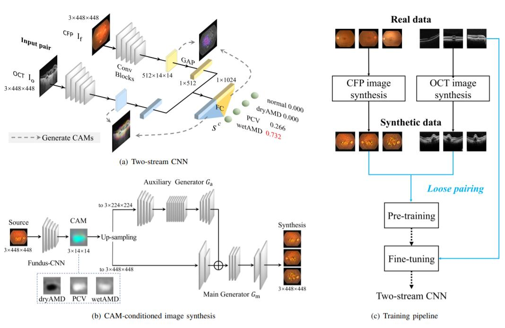

# MMC-AMD

Code and data for multi-modal categorization of age-related macular degeneration (4 classes: normal, dry AMD, pcv, wet AMD)

[MICAAI2019 paper](https://arxiv.org/abs/1907.12023) | [Extended version](https://arxiv.org/abs/2012.01879)

<center>
    
    <br>
    <div style="color:orange;  display: inline-block;    color: black;  padding: 2px;" align="left"><h><b>Proposed end-to-end deep learning solution for multi-modal AMD categorization</b>. Given a pair of CFP and OCT images from a specific eye, our two-stream CNN makes a four-class prediction concerning the probability of the eye being normal, dryAMD, PCV and wetAMD, respectively. </h></div>
</center>

## Requirements
* <b>Python-3.7.10</b>
* <b>CUDA-10.1</b>
* <b>Pytorch-1.1.0</b> & <b>torchvision-0.3.0</b>
  ```conda install pytorch==1.1.0 torchvision==0.3.0 cudatoolkit=10.0```
* <b>Other Packages</b>
  ```pip install -r requirements.txt```
  
## Data

+ **MMC-AMD**, a multi-modal fundus image set consisting of 1,093 color fundus photograph (CFP) images and 1,288 OCT B-scan images (~470MB). Freely available upon request and for ***research purposes*** only. Please submit your request via [Google Form](https://forms.gle/jJT6H9N9CY34gFBWA).
+ **MMC-AMD (splitA)**: An eye-based split of training / validation / test sets (zero eye overlap) [Google drive](https://drive.google.com/file/d/1El2pBzNnQsjRVLE_QwFNhS05HWJMPwkU/view?usp=sharing)
+ **MMC-AMD (splitAP)**: A patient-based split of training / validation / test sets (zero patient overlap) [Google drive](https://drive.google.com/file/d/1KwJdsQmO__TpCW2AcRdsoTocu-zwcZuT/view?usp=sharing)

### Organizaton

By default, all the data folders are assumed to be placed (via symbolic links) at [code/VisualSearch](code/VisualSearch). The folders are organized as follows, see [notebooks/count_data.ipynb](notebooks/count_data.ipynb) for a code-level understanding.
```
./code/VisualSearch/
	mmc-amd/
		ImageData/
			cfp-clahe-448x448/
				f-*.jpg
			oct-median3x3-448x448/
				o-*.jpg
	mmc-amd-splitA-train/
		ImageSets/		(record image ID)
			cfp.txt
			oct.txt
		EyeSets/		(record eye ID)
			cfp.txt
			oct.txt
		SubjectSets/		(record patient ID)
			cfp.txt
			oct.txt
		annotations/		
			cfp.txt
			oct.txt
		ImageData		(symbolic link to $PATH/code/VisualSearch/mmc-amd/ImageData)
		
	mmc-amd-splitA-val/ (mmc-amd-splitA-test/)
		ImageSets/
			cfp.txt
			oct.txt
			mm.txt		(record cfp-oct pairs)
		EyeSets/
			cfp.txt
			oct.txt
		SubjectSets/
			cfp.txt
			oct.txt
		annotations/
			cfp.txt
			oct.txt
		ImageData		(symbolic link to $PATH/code/VisualSearch/mmc-amd/ImageData)
```


## Model Zoo

Download from [Baidu pan](https://pan.baidu.com/s/1vN7J8NDLqWoDhcZ8um-nAA) (code: y1wl), [Google drive](https://drive.google.com/drive/folders/1U1JM7c9mqP79cgLQxgGnBARzR4U_OKUA?usp=sharing)

The test performance of these trained models are as follows. Note that the numbers may differ (slightly) from that reported in the paper, wherein we report averaged result of three independent runs per model.

| Model | Description | splitA-test | splitAP-test |
| :--------- | :---- | ----: | ----: |
| CFP-CNN | A single-modal CNN trained on CFP images | 0.799 | 0.756 |
| OCT-CNN | A single-modal CNN trained on OCT images | 0.891 | 0.877 |
| MM-CNN-da | A two-stream CNN trained on muilti-modal data with our data augmentation strategies | 0.917 | 0.919 |


## Inference

+ [notebooks/inference-and-eval-single-modal.ipynb](notebooks/inference-and-eval-single-modal.ipynb): Run and evaluat4e a single-modal CNN
+ [notebooks/inference-and-eval-multi-modal.ipynb](notebooks/inference-and-eval-multi-modal.ipynb): Run and evaluate a multi-modal CNN

## Training AMD Models

| Script | Purpose |
| :--------- | :---- | 
| bash [scripts/do_train_cfp.sh](scripts/do_train_cfp.sh) | train a CFP-CNN |
| bash [scripts/do_train_oct.sh](scripts/do_train_oct.sh) | train an OCT-CNN |
| bash [scripts/do_train_mm.sh](scripts/do_train_mm.sh) | train an MM-CNN with conventional data argumentation |
| bash [scripts/do_train_mm_loose.sh](scripts/do_train_mm_loose.sh) | train an MM-CNN with loose pairing | 
| bash | train an MM-CNN with synthetic data and loose pairing | 


## CAM-conditioned image synthesis
#### 1. Prepare CAM-conditioned label
* Make sure you have a trained CFP-CNN and a trained OCT-CNN. 
* Run the command below to generate CFP CAMs and OCT CAMs, respectively
  
  ```bash ./scripts/do_generatecam.sh``` 
* link the CAM dir generated in the previous step to ```code/camconditioned-pix2pixHD/datasets/$DATASET_NAME/train_A```
* link the image dir ```code/VisualSearch/mmc-amd/ImageData/$MODALITY``` to ```code/camconditioned-pix2pixHD/datasets/$DATASET_NAME/train_B```
#### 2. Train pix2pixHD and synthesize  
```bash ./scripts/do_synthesis_cfp.sh```

```bash ./scripts/do_synthesis_oct.sh```

The synthetic images can be used in MMC-AMD Training

## Citations

If you find this repository useful, please consider citing:
```
@inproceedings{miccai19-mmcamd,
  author    = {Weisen Wang and Zhiyan Xu and Weihong Yu and Jianchun Zhao and Jingyuan Yang and Feng He and Zhikun Yang and Di Chen and Dayong Ding and Youxin Chen and Xirong Li},
  title     = {Two-Stream {CNN} with Loose Pair Training for Multi-modal {AMD} Categorization},
  booktitle = {MICCAI},
  pages     = {156--164},
  doi = {10.1007/978-3-030-32239-7_18},
  year      = {2019},
}

@article{arxiv-mmcamd,
  author={Weisen Wang and Xirong Li and Zhiyan Xu and Weihong Yu and Jianchun Zhao and Dayong Ding and Youxin Chen},
  title={Learning Two-Stream {CNN} for Multi-Modal Age-related Macular Degeneration Categorization},
  journal={arXiv preprint arXiv:2012.01879},
  doi={10.48550/arXiv.2012.01879},
  year={2020},
}
```

## Acknowledgments

* The code of CAM-conditioned pix2pixHD borrows from [pytorch-CycleGAN-and-pix2pix](https://github.com/junyanz/pytorch-CycleGAN-and-pix2pix).
